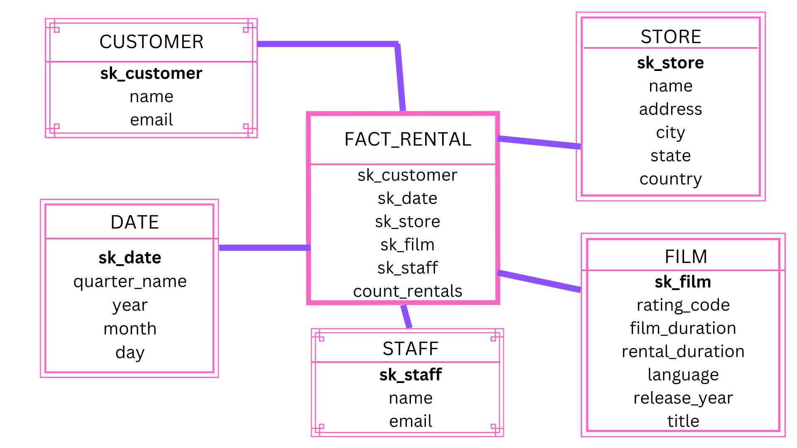
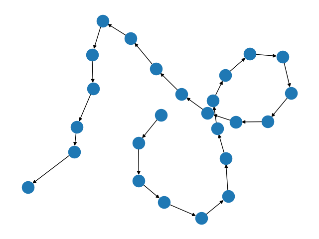

# Data Gathering & Warehousing Final Project
---

This repository contains code that functions as an ***ETL process***

It takes data from a highly normalized transactional database and transforms it into a data warehouse in a star schema for optimizied queries.

---
The following python libraries were crucial in completing this assignement

1. ***Pandas***
2. ***SQLAlchemy***
3. ***NetworkX***
4. ***psycopg***

---
## Project Structure
Below I decsribe where and why things are located there they are.
*   `.config` and `.vscode` - This folder for configuration files (Example: `.json`, `.yaml`, `.toml`, `.ini`)
*   `images` - This folder hold PNG images used for this readme page.
*   `samples` - Place for getting started tutorials.
*   `JennSRC` - This is the source code folder containing all application code and modules.
*   `tools` - This folder stores requirements for running this code
*   `main.py` - This script is the entry point to the ETL process
*   `README` - Markdown file describing the project
*   `requirements.txt` - list of python libraries to install with `pip`


---
Below is an image of the star schema



---

Below is an image of my DAG



---
Below is the code I utilized to create the above image

``` python 
nodes = [(task1, task2), (task2, task3), (task3, task4), (task4, task5), (task5, task6), (task6, task7), (task7, task8), (task8, task9), (task9, task10), (task10, task11), (task11, task12), (task12, task13),(task13, task14), (task14, task15), (task15, task16), (task16, task17), (task17, task18), (task18, task19), (task19, task20), (task20, task21), (task21, task22), (task22, task23), (task23, task24),(task24, task25)             
    ]
    
    DAG = nx.DiGraph(nodes)
   
    nx.draw(DAG)